# Pend Claims Agentic Workflow


## 🚀 Overview

An AI-powered agentic application for analyzing and processing pending healthcare claims using Standard Operating Procedures (SOPs) implemented with LangGraph and Streamlit. This revolutionary system transforms traditional manual claims processing into an intelligent, automated workflow that processes claims in real-time while maintaining full audit trails and transparency.

## 🌟 Key Features

- **🤖 Agentic Processing**: Uses LangGraph to create intelligent, stateful AI workflows
- **📋 SOP-Driven Workflow**: Processes claims based on configurable Standard Operating Procedures
- **🔍 Intelligent Decision Making**: Azure OpenAI-powered agents make complex approval/denial decisions
- **🖥️ Interactive UI**: Real-time Streamlit-based web interface with step-by-step visualization
- **🔌 MCP Integration**: Model Context Protocol for seamless SQL query execution
- **📊 Medical Policy Extraction**: FAISS-powered policy lookup with LLM-based extraction
- **📝 Comprehensive Logging**: Detailed audit trails for compliance and debugging
- **⚡ Real-time Processing**: Process claims from hours to minutes

## 🏗️ System Architecture

### High-Level Architecture


### Physical Architecture


### Logical Architecture


## 🔄 Workflow Process

### Claims Processing Flow

```mermaid
flowchart TD
    START([Start: Enter ICN]) --> VALIDATE{Valid ICN?}
    VALIDATE -->|No| ERROR[Display Error]
    VALIDATE -->|Yes| FETCH[Fetch Claim Data]
    
    FETCH --> GETCOND[Get Condition Codes]
    GETCOND --> LOADSOP[Load Appropriate SOP]
    LOADSOP --> INITSOP{SOP Found?}
    
    INITSOP -->|No| NOSOP[No SOP Available]
    INITSOP -->|Yes| INITWF[Initialize Workflow]
    
    INITWF --> STEP1[Execute Step 1]
    STEP1 --> STEP2[Execute Step 2]
    STEP2 --> STEP3[Execute Step 3]
    STEP3 --> STEPN[Execute Step N...]
    STEPN --> DECISION[AI Decision Node]
    
    DECISION --> ANALYZE[Analyze All Results]
    ANALYZE --> APPROVE{Decision}
    
    APPROVE -->|Approve| FINAL_APPROVE[✅ Claim Approved]
    APPROVE -->|Deny| FINAL_DENY[❌ Claim Denied]
    APPROVE -->|Pend| FINAL_PEND[⏳ Claim Pended]
    
    FINAL_APPROVE --> LOG[Log Decision]
    FINAL_DENY --> LOG
    FINAL_PEND --> LOG
    
    LOG --> DISPLAY[Display Results]
    DISPLAY --> END([End])
    
    ERROR --> END
    NOSOP --> END
```



### SOP Execution Flow


## 📊 Data Model

### Database Schema


### SOP Structure


## 🚀 Getting Started

### Prerequisites

- Python 3.9+
- SQLite
- Azure OpenAI API access
- Git

### Installation

1. **Clone the repository**
   ```bash
   git clone https://github.com/phoenix-4u/Pend_Claims_Agentic_Workflow.git
   cd Pend_Claims_Agentic_Workflow
   ```

2. **Create and activate virtual environment**
   ```bash
   python -m venv .venv
   source .venv/bin/activate  # On Windows: .venv\Scripts\activate
   ```

3. **Install dependencies**
   ```bash
   pip install -r requirements.txt
   ```

4. **Set up environment variables**
   ```bash
   cp .env.example .env
   # Edit .env with your configuration
   ```

5. **Initialize the database**
   ```bash
   python -m scripts.seed_database
   python scripts/create_hruk.py
   ```

### Configuration

Create a `.env` file with the following variables:

```env
# Azure OpenAI Configuration
AZURE_OPENAI_API_KEY=your_api_key_here
AZURE_OPENAI_ENDPOINT=https://your-resource.openai.azure.com/
AZURE_OPENAI_API_TYPE=azure
OPENAI_API_VERSION=2024-05-01-preview
AZURE_OPENAI_DEPLOYMENT_NAME=your_deployment_name
MODEL_NAME=gpt-4

# Application Settings
DEBUG=True
LOG_LEVEL=INFO

# Database Configuration
DATABASE_URL=sqlite:///./data/claims.db

# MCP Server Configuration
MCP_SERVER_URL=http://127.0.0.1:8000/sse

# FAISS Configuration
FAISS_INDEX_DIR=faiss_medpol_single

# Paths
DATA_DIR=./data
LOGS_DIR=./logs
```

## 🏃‍♂️ Running the Application

### Development Mode

1. **Start the MCP Server**
   ```bash
   python -m app.core.mcp_server
   ```

2. **Start the Streamlit UI**
   ```bash
   streamlit run app/ui/streamlit_app.py
   ```

3. **Access the application**
   - Streamlit UI: http://localhost:8501
   - MCP Server: http://localhost:8000

### Testing the MCP Client

```bash
python -m app.core.mcp_client
```

## 📁 Project Structure

```
pend-claims-agentic-workflow/
├── app/
│   ├── config/
│   │   └── logging_config.py      # Logging configuration
│   ├── core/
│   │   ├── mcp_client.py          # MCP client with LangGraph workflows
│   │   └── mcp_server.py          # MCP server with policy extraction
│   ├── db/
│   │   ├── base.py                # Database session management
│   │   ├── crud.py                # CRUD operations
│   │   └── models.py              # SQLAlchemy models
│   ├── sops/
│   │   ├── loader.py              # SOP loading and management
│   │   └── models.py              # SOP data models
│   ├── ui/
│   │   └── streamlit_app.py       # Streamlit user interface
│   └── workflows/
│       └── claim_processor.py     # LangGraph claim processing workflow
├── data/
│   ├── claims.db                  # SQLite database
│   └── sops/                      # SOP definition files
├── scripts/
│   ├── seed_database.py           # Database initialization
│   └── create_hruk.py             # HRUK table creation
├── logs/                          # Application logs
├── faiss_medpol_single/           # FAISS vector store
├── requirements.txt               # Python dependencies
├── .env.example                   # Environment variables template
└── README.md                      # This file
```

## 🔧 Core Components

### Claims Processor

The `ClaimProcessor` class orchestrates the entire claims processing workflow using LangGraph:

- **State Management**: Maintains claim processing state across workflow steps
- **SOP Execution**: Dynamically executes SOP steps based on condition codes
- **AI Decision Making**: Uses Azure OpenAI to analyze results and make final decisions
- **Error Handling**: Comprehensive error handling with fallback mechanisms

### MCP Integration

The Model Context Protocol (MCP) provides seamless integration between components:

- **MCP Server**: Exposes database operations and policy extraction tools
- **MCP Client**: Orchestrates tool execution within LangGraph workflows
- **Tool Registry**: Dynamic tool discovery and invocation

### Policy Extraction

Advanced medical policy extraction using FAISS and LLM:

- **Vector Search**: FAISS-powered similarity search for policy documents
- **Structured Extraction**: LLM-based extraction of structured policy data
- **Caching**: Efficient caching of frequently accessed policies

## 📋 Standard Operating Procedures (SOPs)

### SOP Structure

SOPs are defined as JSON files with the following structure:

```json
{
  "sop_code": "F027",
  "name": "Provider Specialty Validation",
  "description": "Validates provider specialty against procedure codes",
  "version": "1.0.0",
  "condition_codes": ["F027"],
  "entry_point": 1,
  "steps": [
    {
      "step_number": 1,
      "description": "Identify the Provider Specialty Code on the claim",
      "query": "SELECT provider_speciality FROM claim_headers WHERE icn = '{icn}';"
    }
  ]
}
```

### Available SOPs

- **B007**: Outpatient Physical Therapy Services
- **F027**: Provider Specialty Validation

### Creating New SOPs

1. Create a new JSON file in `data/sops/`
2. Define the SOP structure with steps and queries
3. Test using the MCP client tools
4. Deploy to production

## 🔍 API Documentation

### MCP Tools

The system exposes the following MCP tools:

#### Database Operations
- `execute_query`: Execute SQL queries against the claims database
- `get_all_sops`: Retrieve all SOP definitions
- `get_sop_by_code`: Get specific SOP by code
- `get_database_schema`: Get database schema information

#### Policy Extraction
- `extract_policy_json_by_code`: Extract medical policy data for procedure codes

### REST API Endpoints

- `GET /health`: Health check endpoint
- `POST /api/mcp/query`: Execute MCP queries
- `GET /api/docs`: Swagger API documentation

## 🧪 Testing

### Unit Tests

```bash
pytest tests/
```

### Integration Tests

```bash
pytest tests/integration/
```

### MCP Client Testing

```bash
python -m app.core.mcp_client
```

## 📊 Monitoring and Logging

### Log Levels

- **DEBUG**: Detailed debugging information
- **INFO**: General information about system operation
- **WARNING**: Warning messages for potential issues
- **ERROR**: Error messages for failed operations
- **CRITICAL**: Critical errors that may cause system failure

### Log Files

- `logs/pend_claim_analysis.log`: Main application log
- Rotation: Daily rotation with 30-day retention

### Monitoring Dashboards

The system provides real-time monitoring through:

- Streamlit UI for claim processing status
- MCP tool execution metrics
- Database query performance
- AI decision accuracy tracking

## 🔐 Security Considerations

### Data Protection

- **Encryption**: All sensitive data encrypted at rest and in transit
- **Access Control**: Role-based access control for different user types
- **Audit Trails**: Comprehensive logging of all operations
- **HIPAA Compliance**: Healthcare data handling compliance

### API Security

- **Authentication**: API key-based authentication for MCP server
- **Rate Limiting**: Request rate limiting to prevent abuse
- **Input Validation**: Comprehensive input validation and sanitization

## 🚀 Deployment

### Production Deployment

1. **Environment Setup**
   ```bash
   pip install gunicorn
   ```

2. **Start Services**
   ```bash
   # MCP Server
   gunicorn -k uvicorn.workers.UvicornWorker app.core.mcp_server:api
   
   # Streamlit UI
   streamlit run app/ui/streamlit_app.py --server.port 8501
   ```

3. **Process Management**
   - Use PM2 or systemd for process management
   - Configure health checks and auto-restart
   - Set up log rotation and monitoring

### Docker Deployment

```dockerfile
FROM python:3.9-slim

WORKDIR /app
COPY requirements.txt .
RUN pip install -r requirements.txt

COPY . .
EXPOSE 8501 8000

CMD ["streamlit", "run", "app/ui/streamlit_app.py"]
```

## 🤝 Contributing

### Development Workflow

1. Fork the repository
2. Create a feature branch
3. Make your changes
4. Add tests for new functionality
5. Submit a pull request

### Code Standards

- **PEP 8**: Follow Python code style guidelines
- **Type Hints**: Use type hints for all functions
- **Documentation**: Document all public interfaces
- **Testing**: Maintain >90% test coverage

### Commit Messages

Use conventional commit messages:
- `feat:` New features
- `fix:` Bug fixes
- `docs:` Documentation updates
- `test:` Test additions or modifications

## 🐛 Troubleshooting

### Common Issues

#### MCP Connection Errors
```
RuntimeError: There is no current event loop in thread 'ScriptRunner.scriptThread'
```
**Solution**: Use `asyncio.run()` only in standalone scripts, not in Streamlit apps.

#### Database Schema Errors
```
sqlite3.OperationalError: no such column: provider_specialty
```
**Solution**: Run the database migration script to add missing columns.

#### Decision Node Errors
```
AttributeError: 'NoneType' object has no attribute 'upper'
```
**Solution**: Ensure decision is always set with fallback logic.

### Debug Mode

Enable debug mode by setting `DEBUG=True` in your `.env` file.


## 📄

## 👥 Authors

- **Dipanjan Ghosal** - *Lead Developer* 

## 🙏 Acknowledgments

- LangChain team for the excellent framework
- Streamlit team for the intuitive UI framework
- Azure OpenAI for powerful AI capabilities
- FastAPI for the high-performance API framework


**Built with ❤️ for the healthcare industry**